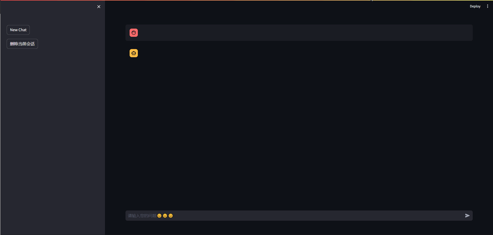

# First

You need to deploy the ChatGLM3-6B model on your machine and install the python library streamlit.

# Second

Put the `my_web_demo_streamlit.py` wherever you like, then specify the model path in line 18 (mine is `../chatglm3-6b`):

```python
MODEL_PATH = os.environ.get('MODEL_PATH', '../chatglm3-6b')
```

Your model dir should have the following files:

```
config.json
configuration_chatglm.py
modeling_chatglm.py
pytorch_model-00001-of-00007.bin
pytorch_model-00002-of-00007.bin
pytorch_model-00003-of-00007.bin
pytorch_model-00004-of-00007.bin
pytorch_model-00005-of-00007.bin
pytorch_model-00006-of-00007.bin
pytorch_model-00007-of-00007.bin
pytorch_model.bin.index.json
quantization.py
special_tokens_map.json
tokenization_chatglm.py
tokenizer_config.json
tokenizer.model
```

# Demo



# Addition

Since the slider in sidebar will cause some contradictory bugs, so I remove them 😂. But you can monitor these param in line 48-50:

```python
max_length = 8192
top_p = 0.8
temperature = 0.6
```

